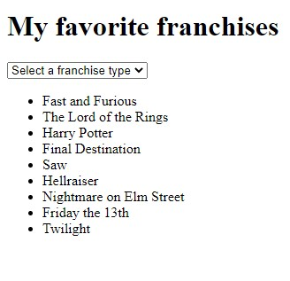

# DOM Events
## What is this?
This repository contains a JS exercise I realized the 19-20th of November 2020 during my webdev training.
In this exercise, we were asked to modify a list and add different events using JS. For more info, you may read the instructions [here](./assets/instructions.md).  

## Screenshot
  
    
